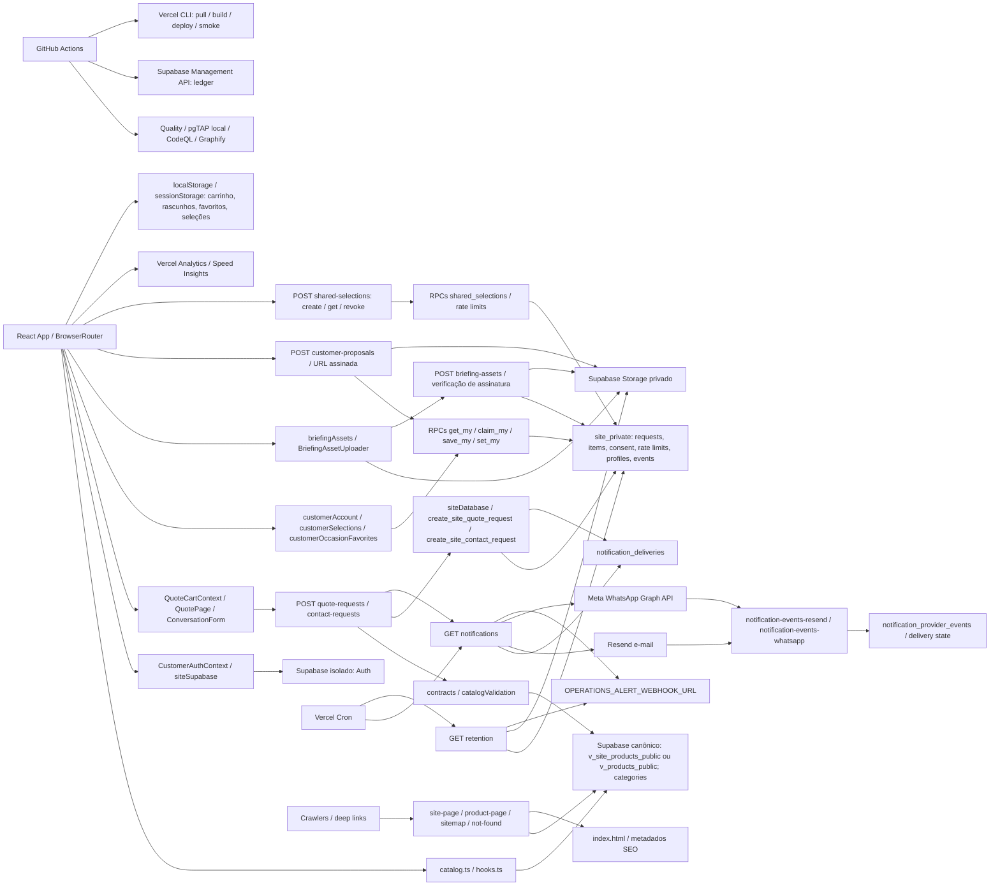

# Auditoria técnica — Promo Brindes V1

Data: 24/09/2026. Auditoria concluída dentro dos limites abaixo; somente leitura, exceto este arquivo e `PLANO_100.md`.

## 1. Estado geral e contexto

Sistema: catálogo B2B público, seleção de brindes e solicitação de orçamento, sem checkout.
Stack: React/TypeScript/Vite, APIs Vercel, Supabase Auth/PostgreSQL/Storage, Resend e WhatsApp.
Repositório: `/home/joaquim_ataides/projetos/Promo_Brindes_V1`; GitHub `adm01-debug/Promo_Brindes_V1`.
SHA local observado: `da9f55c4e929d82f88c78179f59b5f199e6a5f79`; worktree inicialmente limpo.
Alvos: banco isolado `xlzmclcjdncjfdrjxclt`; catálogo canônico `doufsxqlfjyuvxuezpln` somente leitura.
Acessos confirmados: código, GitHub/Actions, SQL administrativo read-only do banco isolado, Vercel e páginas públicas; catálogo canônico consultado somente em leitura.
Restrições: nenhuma correção, migration, merge, deploy, teste com gravação ou envio a clientes autorizado nesta missão.
Orçamento: sem teto explícito; priorização dos cinco fluxos abaixo.
Fluxos: descoberta do produto; envio do orçamento; autenticação/histórico; seleções/favoritos/anexos; notificações/retenção.
Resultado: 22 achados — P0: 0; P1: 7; P2: 14; P3: 1. Não há certificação “10/10”.
Cinco riscos prioritários: mistura de favoritos entre titulares; rollback/reordenação de favoritos; release bloqueado; Analytics indisponível; fronteira pública do catálogo mais ampla que a view mínima.
Nenhuma correção ou atualização online foi realizada; o plano em `PLANO_100.md` contém 22 unidades reais de trabalho.

## 2. Mapa de conexões



Fontes abertas: `src/App.tsx`, `src/lib/catalog.ts`, `src/lib/quoteRequest.ts`, `src/lib/customerAccount.ts`, `src/lib/customerSelections.ts`, `src/lib/briefingAssets.ts`, `api/_lib/leadHandler.ts`, `api/_lib/siteDatabase.ts`, `vercel.json`, `.github/workflows/release.yml`. Os demais elos foram aprofundados nos fluxos abaixo. Nenhuma integração operacional N8N/Bitrix/Evolution foi localizada no código deste site; campos bitrix_* na view legada não provam integração ativa do site.

### Contexto técnico do mapa

Entradas: `index.html` → `src/main.tsx` → `src/App.tsx`; `api/*.ts` na Vercel; migrations em `site-supabase/supabase/migrations/`; SQL do canônico apenas espelhado em `docs/sql/canonical/`. Árvore de trabalho: `src/{components,context,lib,pages,test,types}`, `api/_lib`, `shared/`, `tests/api`, `e2e/`, `scripts/_lib`, `.github/workflows/`, `site-supabase/supabase/`, `docs/`, `public/{brand,images}`. Não foram alterados arquivos nesses diretórios.

Versões do lockfile lido: React/React DOM 19.3.0; Vite 8.3.0; TypeScript 5.9.3; Supabase JS 2.116.0; React Router 7.18.4; Vitest 5.0.1; Playwright 1.63.0; jsdom 30.1.0; undici 8.10.2. Runtime local: Node 24.19.0. Dev/preview Vite: portas 4174/4175. Build `tsc -b && vite build`; publicação orquestrada por release.yml, com deploy Git automático desativado em vercel.json.

| Entrada HTTP | Contrato observado | Fronteira de autorização |
|---|---|---|
| quote-requests / contact-requests | POST, JSON limitado, origem exata, idempotência | Público por intenção; payload normalizado sem owner/role arbitrário; rate limit e persistência por RPC |
| customer-proposals | POST, UUID, origem e Bearer | get_my_proposal_document vincula proposta → pedido → auth.uid; URL privada assinada por 60 s |
| briefing-assets | POST, UUID, origem e Bearer | get_my_briefing_asset_verification exige titular, sem vínculo e não expirado; Storage privado |
| shared-selections | POST create/read/revoke | Leitura por token opaco; revogação exige managementToken separado; hashes e rate limits no servidor |
| notifications / retention | GET interno | CRON_SECRET com comparação em tempo constante; GET sem segredo retornou 401 |
| notification-events-resend | POST raw body | HMAC Svix com janela de 300 s, deduplicação de eventos por RPC |
| notification-events-whatsapp | GET challenge / POST raw body | Verify token para GET; HMAC SHA-256 para POST; indisponível sem configuração |
| product-page / site-page / sitemap / not-found | GET/HEAD | Conteúdo público, escape HTML/XML/JSON-LD; metadados privados noindex |

Rotas React inventariadas: `/`, `/catalogo`, `/catalogos`, `/montar-kit`, `/datas-comemorativas`, `/produto/:identifier`, `/orcamento`, `/selecoes/compartilhada`, `/ideias/:topic`, `/sobre`, `/contato`, `/privacidade`, `/entrar`, `/auth/confirm`, `/definir-senha`, `/minha-conta`, `/minha-conta/orcamentos/:id` e fallback `*`.

### Cinco fluxos rastreados e limites encontrados

| Fluxo | Caminho conferido | Falha/limite resultante |
|---|---|---|
| Descobrir → filtrar → produto | CatalogPage/useCatalogPageState → hooks/catalog → view pública → ProductPage | A-011 deadline; A-015 galeria; A-021 cor; A-022 alcance da chave |
| Selecionar → enviar orçamento | QuoteCart/QuotePage → quoteRequest/http → contracts/leadHandler → reconcileQuoteItems → persistLead/RPC → quote_requests/items/consent/outbox | A-006 leitura HTTP; A-019 deadline total; env de provedores adiada |
| Entrar → histórico → proposta | CustomerAuthProvider/CustomerRoute → claimHistory → get_my_quote_requests/get_my_quote_request → customer-proposals/Storage | A-008 paginação; A-009 atualização de senha; sessão A/B real não exercitada |
| Salvar/compartilhar/anexar | SavedSelections/customerSelections; useOccasionFavorites/RPC; briefingAssets → verificação → vínculo; sharedSelection → token → reidratação | A-003/004/007/010 favoritos; A-005 inspeção do arquivo; mutations reais excluídas |
| Fila → provedor → evento → retenção | leadHandler/cron → notifications → outbox/lease → Resend/Meta → webhooks → eventos; retention → exclusão/queue de blobs | A-012 shape de webhook; A-019 prazo; entrega e alertas externos não homologados |

Autorização lida no banco remoto: get_my_quote_request filtra simultaneamente `request.id = p_request_id` e `request.customer_user_id = auth.uid()`, excluindo spam; listagem usa o mesmo titular. claim_my_quote_requests exige e-mail confirmado em auth.users e só associa registros sem titular com e-mail correspondente, recusando identidade apagada. get_my_proposal_document faz o vínculo ao pedido do titular antes da assinatura. Funções de seleção usam titular e versão esperada. Esses predicados são evidência estática; não equivalem a um teste mutante de IDOR com duas contas.

## 3. Achados

### Infra e deploy

#### A-001 · [P1] · infra — Release para na leitura das configurações da Vercel
Evidência: `gh run view 35999552421 --json conclusion,headSha,jobs` retornou `failure` no SHA `e7005db`; gates e conferência do ledger concluíram com sucesso, build/deploy falhou, smoke foi ignorado. `gh run view 35999552421 --log-failed` contém `Error: Could not retrieve Project Settings` em `vercel pull`. Alvos declarados em `.github/workflows/release.yml:23–24,88`.
Impacto: correções integradas não são promovidas por esse release; sucesso de migration não comprova publicação da aplicação.
Causa raiz: resolução/acesso do projeto Vercel falha antes do build. A sessão local conseguiu executar `vercel project inspect promo-brindes-v1 --scope juca1 --non-interactive`, e os IDs coincidem com o workflow; isso restringe a investigação ao contexto/credencial do CI, sem provar token expirado. Não foram trocados segredos nem reexecutado o deploy.

#### A-002 · [P2] · infra — Runtime do release viola requisitos do lockfile
Evidência: `.github/workflows/release.yml:79` fixa Node `22.13.1`; `package-lock.json` fixa `jsdom@30.1.0` com Node `^22.22.2 || ^24.15.0 || >=26.0.0` e `undici@8.10.2` com Node `>=22.19.0`. O log do mesmo release emite `EBADENGINE` para cinco pacotes. `node --version` nesta sessão retorna `v24.19.0`, enquanto `package.json:8` declara `22.x`.
Impacto: ambiente de release não é suportado por dependências instaladas; validação local não reproduz seu runtime. Não foi observado crash causado por essa incompatibilidade nesta sessão.
Causa raiz: pins de Node e engines não foram reconciliados com os upgrades do lockfile.

### Frontend — concorrência

#### A-003 · [P1] · frontend — Revisão reutilizada permite rollback de uma ação antiga
Evidência: `src/lib/useOccasionFavorites.ts:211–218,230–233`: revisão calculada a partir do mapa e entrada removida no finally. Simulação em memória do hook real: salvar(revisão 1) → remover(revisão 2) → confirmar remoção → salvar(novamente revisão 1) → rejeitar primeira escrita; saída `SIM_FAV_REVISION_REUSE { latestIntent: true, ui: false }`, com mensagem de restauração. Sem chamadas reais a banco.
Impacto: um erro de uma solicitação antiga desfaz o favorito mais recente da mesma conta/data.
Causa raiz: contador de identidade da mutação é apagado ao concluir a última promise; a próxima ação reutiliza um número ainda pertencente a outra promise em trânsito.

#### A-004 · [P1] · frontend/backend — Escritas de favorito paralelas podem divergir da última intenção
Evidência: `src/lib/useOccasionFavorites.ts:215–217` dispara RPC por clique sem serializar; simulação com duas escritas concluídas na ordem remover→salvar retornou `SIM_FAV_SERVER_ORDER { calls: [true,false], ui: false, server: true }`. Fronteira RPC simulada, sem alegar ocorrência em produção.
Impacto: UI mostra remoção, mas persistência termina em adição; nova sessão pode restaurar o item.
Causa raiz: épocas ignoram callbacks antigos na UI, mas não ordenam os efeitos no servidor nem enviam revisão monotônica ao contrato SQL.

### Arquivos

#### A-005 · [P2] · backend — Selo de verificação aceita apenas cabeçalho, inclusive PDF truncado
Evidência: `api/_lib/fileSignatures.ts:11–18,38` valida `%PDF-1.x/2.x` e lê até 1.024 bytes; `api/briefing-assets.ts:123–148` promove isso a verifiedAt. Execução em memória da função real retornou `SIM_PDF { truncated: true, activeMarker: true }` para `%PDF-1.7` isolado e prefixo contendo `/JavaScript /JS`.
Impacto: arquivo inválido ou com conteúdo ativo pode ser classificado como verificado. Não foi executado payload em visualizador nem demonstrada execução remota.
Causa raiz: assinatura de formato é utilizada como critério único, sem parser integral, política de conteúdo ativo ou versão de validação.

### Contratos e sessão

#### A-006 · [P2] · frontend/backend — Timeout termina antes da leitura do corpo HTTP
Evidência: `src/lib/http.ts:87–90` limpa o timer antes de `response.json()`; padrão também em `api/_lib/catalogValidation.ts:77–82` e `api/_lib/siteDatabase.ts:191–194`. Simulação em memória da função `postJson`, com headers imediatos e corpo pendente, retornou `SIM_BODY_TIMEOUT {timerCleared:true,requestSettled:false}`.
Impacto: conexão que entrega headers e trava no corpo deixa envio pendente sem o limite anunciado; frequência real não medida.
Causa raiz: o finally cobre somente `fetch`, não o consumo integral da resposta.

#### A-007 · [P1] · segurança/frontend — Cache legado de outra conta é promovido como anônimo
Evidência: `src/lib/useOccasionFavorites.ts:36–42,125–128,144–151`. O retorno antecipado de `loadFavorites('anonymous')` usa a mesma chave do cache legado sem conferir seu proprietário. Simulação do hook real com proprietário legado `account-old` e usuário atual `account-new`: `SIM_LEGACY_OWNER {imported:[{id:'dia-do-cliente',saved:true}],ui:['dia-do-cliente']}`.
Impacto: datas de uma conta anterior no mesmo navegador são exibidas e importadas para outra conta quando existe cache legado; não expõe orçamentos nem prova ocorrência na base real.
Como explorar: abrir outra conta no navegador que conserva a chave legada de favoritos pertencente ao usuário anterior faz o hook atribuir e persistir essas datas ao novo titular.
Causa raiz: a chave anônima e a chave legada são iguais, tornando inefetiva a verificação de owner no caminho mais comum.

#### A-008 · [P2] · frontend — Página fracionária vira offset incompatível com RPC
Evidência: `src/pages/CustomerAccountPage.tsx:24,37,75–77`. Executar a expressão real para `?page=1.1` produz offset `1.200000000000001`; `?page=999` produz 11976 sem reconciliação com o total. O RPC `get_my_quote_requests` recebe offset inteiro.
Impacto: links malformados falham no histórico; página além do total pode exibir “PRIMEIRO BRIEFING” apesar de haver registros, sem retorno direto à primeira página quando totalPages é 1.
Causa raiz: clamp numérico não normaliza inteiros nem revalida a página depois da resposta paginada.

#### A-009 · [P2] · frontend/UX — Atualização de senha sem bloqueio de submissão concorrente
Evidência: `src/pages/SetPasswordPage.tsx:15–24`: cada submit chama `auth.updateUser`, não há estado pending, botão disabled ou try/catch; o formulário aparece inclusive enquanto auth.loading é true.
Impacto: cliques repetidos enviam atualizações paralelas, sem indicador; rejeição inesperada da promise não vira erro visível. Não foram feitas alterações reais de senha.
Causa raiz: o fluxo possui somente done/error, sem estado de execução e sem proteção de sessão durante a operação.

#### A-010 · [P1] · frontend — Promoção de favoritos substitui intenção mais recente
Evidência: `src/lib/useOccasionFavorites.ts:144–151` aguarda importação anônima e depois escreve `intentsRef.current.set(id, true)` incondicionalmente. Simulação do hook: cache anônimo e da conta contêm a data; importação fica pendente; usuário remove e recebe confirmação; importação conclui. Resultado `SIM_PROMOTION {intent:false,ui:true,writes:[true,false]}`.
Impacto: a primeira sincronização pode ressuscitar uma data removida durante a importação. Distinto de A-003: ocorre mesmo sem rejeição ou reutilização de revisão.
Causa raiz: a origem anônima recebe prioridade sobre a ação autenticada posterior, sem revisão capturada antes do await; o catch da promoção também repõe snapshot remoto sem reaplicar intenções.

#### A-011 · [P2] · frontend — Catálogo não possui prazo máximo de leitura
Evidência: `src/lib/catalog.ts:276–310` passa apenas o AbortSignal do chamador para fetch; `src/lib/hooks.ts:32–40` só aborta na limpeza do efeito. O retry ocorre após erro/status, não quando a conexão permanece pendente.
Impacto: consulta que não termina mantém skeleton/loading indefinidamente até a pessoa navegar; afeta catálogo, produtos e categorias. Frequência em produção não medida.
Causa raiz: cancelamento de navegação foi tratado como substituto de deadline de rede.

### Integrações

#### A-012 · [P2] · backend — JSON válido com estrutura errada derruba handlers de webhook
Evidência: `api/notification-events-resend.ts:60–67` e `api/notification-events-whatsapp.ts:120–133` fazem cast de JSON sem validação estrutural. Execução dos handlers reais com verificador de assinatura simulado como aprovado: Resend com `null` lança TypeError em `payload.type`; WhatsApp com `{entry:{}}` lança TypeError em `.flatMap`. Nenhum RPC foi executado.
Impacto: payload assinado incompatível produz falha não controlada, em vez de 400 estruturado; pode induzir reentregas inúteis. Os provedores estão adiados e não foi demonstrado ataque sem assinatura.
Causa raiz: tipos TypeScript são usados como se validassem dados externos em runtime, e acesso ao payload ocorre fora do bloco de tratamento.

#### A-013 · [P1] · observabilidade — Analytics não carrega na produção
Evidência: GET real de `https://promo-brindes-v1.vercel.app/_vercel/insights/script.js` retornou 404, corpo de 1.800 caracteres; navegador confirmou 404 no catálogo e produto. `src/App.tsx:94` injeta Analytics; `src/lib/analytics.ts:111–123` e `src/lib/clientObservability.ts:10–21` dependem dele.
Impacto: eventos do funil e erros de frontend enviados por esse canal não chegam por esta integração; a ausência de eventos não significa ausência de falhas.
Causa raiz: artefato/serviço de Web Analytics não está disponível no deployment consultado. Diferenciar habilitação no projeto e publicação do script requer inspeção do painel; Speed Insights respondeu 200 e não substitui eventos de funil.

#### A-014 · [P2] · privacidade — Speed Insights não usa sanitização aplicada ao Analytics
Evidência: `src/App.tsx:94–95` fornece beforeSend somente ao Analytics; `src/lib/analytics.ts:96–108` remove parâmetros e IDs, mas não é conectado ao Speed Insights. O script de Speed Insights baixado nesta sessão respondeu 200 e contém `let t=location.href` e retorno da URL original quando não recebe rota distinta; a versão instalada aceita beforeSend (`node_modules/@vercel/speed-insights/dist/react/index.mjs:133–136`).
Impacto: parâmetros arbitrários e identificadores de rota podem acompanhar métricas, contrariando a minimização já aplicada ao outro canal. Não foi observado envio de dado pessoal real nesta sessão.
Causa raiz: políticas de redaction divergentes entre dois coletores montados no mesmo App.

### UX e cobertura

#### A-015 · [P1] · acessibilidade — Galeria declara lista sem filhos listitem
Evidência: `src/pages/ProductPage.tsx:188–195` usa `role="list"` com filhos button diretos. Axe executado no produto publicado `/produto/agenda-diaria-2026-02469`, em 390 e 1440 px, retornou `aria-required-children`, alvo `.product-gallery__thumbs`, mensagem `Element has children which are not allowed: button[aria-label]`. A etiqueta critical é do axe, não classificação P0 desta auditoria.
Impacto: a estrutura acessível da galeria é inválida nos produtos com múltiplas fotos; a suíte automatizada não cobre essa variante.
Causa raiz: semântica de lista foi atribuída a um grupo de botões sem itens de lista. `e2e/smoke.spec.ts:147–163` omite a rota de produto no laço de axe e a fixture inicial tem images vazio.

### Banco e consistência de ambientes

#### A-016 · [P2] · banco — Privilégios efetivos de duas RPCs divergem entre local e remoto
Evidência: SELECT em `pg_proc.proacl` encontrou EXECUTE para service_role no remoto em `public.list_my_occasion_favorites()` e `public.set_my_occasion_favorite(text,boolean)`, ausente no local. SELECT em `pg_default_acl` confirma default de funções public/postgres remoto `{postgres=X/postgres,service_role=X/postgres}`, local `{postgres=X/postgres}`. A migration `site-supabase/supabase/migrations/20260923130000_add_customer_occasion_favorites.sql:106–109` revoga public/anon, mas não service_role.
Impacto: mesmo ledger e mesmos corpos SQL não reproduzem permissões idênticas; futuras funções podem herdar grants não pretendidos. As duas funções verificam auth.uid; não foi demonstrado acesso cruzado por esse grant.
Causa raiz: migration depende de defaults externos, divergentes entre ambientes, em vez de estabelecer ACL completa.

#### A-017 · [P2] · banco — Índice de titular não cobre todos os registros da FK
Evidência: SELECT em `pg_indexes` mostrou `quote_requests_customer_created_idx ON site_private.quote_requests(customer_user_id,created_at DESC) WHERE customer_user_id IS NOT NULL AND status <> 'spam'`; nenhum índice completo com customer_user_id como primeira coluna foi encontrado no inventário de 66 índices. FK `quote_requests_customer_user_id_fkey` existe e inclui também spam.
Impacto: verificação referencial sobre titular pode demandar varredura com crescimento, especialmente registros spam; não há degradação medida na base atual pequena.
Causa raiz: índice parcial adequado ao histórico do cliente foi também considerado cobertura integral da FK. Os outros cinco candidatos do rastreio inicial têm índices parciais IS NOT NULL suficientes e não são falhas.

### Infra e limites de execução

#### A-018 · [P2] · infra — HTML das rotas profundas é buscado na origem pública de produção
Evidência: `api/_lib/publicProductPage.ts:60–81,131–144` constrói o shell com `VITE_PUBLIC_URL`/`SITE_PUBLIC_ORIGIN`, sem identidade do deployment. VITE_PUBLIC_URL aparece nos ambientes production e preview; o fallback também é a origem de produção. `api/site-page.ts:122–130` reutiliza o shell nas rotas profundas.
Impacto: um preview com build distinto pode receber referências a assets do build de produção; no próprio release, cache/alias pode misturar versões. Não foi comprovado um 404 de chunk em preview nesta sessão.
Causa raiz: URL canônica de SEO foi usada também como localização do artefato executável, sem vínculo à versão em teste.

#### A-019 · [P2] · backend/frontend — Orçamento de execução do envio excede espera do cliente
Evidência: `src/lib/http.ts:1` limita envio a 15 s; `api/_lib/leadHandler.ts:105–117` aguarda catálogo (até 5 s), persistência (até 10 s) e confirmação (até 7 s em `api/notifications.ts:604`). Limites por etapa permitem aproximadamente 22 s, além do parsing; Vercel aceita 30 s na rota quote-requests.
Impacto: após habilitação dos provedores, etapas lentas ainda dentro de seus limites podem persistir o pedido, mas causar mensagem de timeout no navegador antes da confirmação. Idempotência reduz duplicação, não a ambiguidade de UX. Latência real deste cenário não medida; provedores continuam adiados.
Causa raiz: deadlines locais foram definidos independentemente, sem prazo ponta a ponta nem reserva explícita para responder após persistir.

### Catálogo, conteúdo e fronteira pública

#### A-020 · [P3] · UX — Landing de ideias não distingue catálogo vazio
Evidência: `src/pages/IdeaLandingPage.tsx:21`: após loading/error, renderiza diretamente `catalog.data.products.map(...)`, sem estado de zero resultados. A seção mantém “Ver referências” e “Ver curadoria completa” mesmo sem referências.
Impacto: resultado vazio se apresenta como área em branco, sem explicar ausência de correspondência; não há alegação de que o catálogo de produção esteja vazio.
Causa raiz: faltou o quarto estado da consulta (sucesso vazio) na composição desta tela.

#### A-021 · [P2] · backend — Cor sem variantId não é reconciliada com o catálogo real
Evidência: `api/_lib/catalogValidation.ts:33–38,102–121` descarta swatches sem variant_id e só valida item.variantId. `pg_get_viewdef('public.v_site_products_public'::regclass,true)` executado no canônico confirma swatches públicos com apenas color_name/color_hex/image_url. Simulação da função real com catálogo contendo somente Azul aceitou `colorName:'Cor inexistente',colorHex:'#123456'` sem variante.
Impacto: pedido pode preservar cor inválida ou adulterada apesar de dizer que reconcilia a seleção com catálogo; nos swatches públicos atuais, nenhum item passa pela canonicalização de cor baseada em ID.
Causa raiz: reconciliação assume um identificador intencionalmente excluído do contrato público. Não deve ser “corrigida” expondo silenciosamente IDs internos; nomes/imagens públicos precisam de contrato compatível e ambiguidade explícita.

#### A-022 · [P2] · segurança/arquitetura — View mínima não restringe o alcance da chave pública
Evidência: GET read-only real de `/rest/v1/v_products_public?select=sale_price,supplier_id,supplier_product_url,bitrix_product_id&limit=1`, com a chave pública já usada no frontend, respondeu 200 com uma linha e os quatro campos não nulos; valores deliberadamente omitidos. SELECT em pg_catalog confirmou que v_site_products_public é security_invoker=true e depende da view legada. `docs/DATABASE_PUBLIC_CONTRACT.md:17–23,47–53` documenta o limite, revalidado aqui, não tomado como prova histórica.
Impacto: a ausência desses campos na UI/view mínima não impede consulta direta a informações comerciais e de integração. Não foi demonstrada exposição de dados de clientes; não se presume que todo preço público seja segredo.
Causa raiz: fronteira pública compartilha privilégios legados necessários a outros consumidores. Ocultar campos no select do frontend não equivale a restringir autorização no banco.
Limite de correção: qualquer alteração em `doufsxqlfjyuvxuezpln` depende de aprovação específica do PO; revogar a view legada isoladamente pode quebrar a view mínima e o sistema interno.

## 4. NÃO VERIFICADO

- POSTs de orçamento/contato/compartilhamento, cadastro/login com envio de mensagem, alteração de senha, upload, revogação, reexecução de jobs, deletes e migrations: excluídos pelo escopo somente leitura. Até a ação `read` de shared-selections atualiza rate limit; não foi chamada na base real.
- Entrega real via Resend/WhatsApp, callbacks externos, SLA, replay de evento real e alertas operacionais: credenciais continuam ausentes por decisão anterior do usuário. Sem alterar essa decisão.
- Cutover SITE_SUPABASE_SERVICE_JWT: variável ausente em production; fallback server-side service_role permanece. Não foi alegado corte de privilégio concluído.
- Backup/PITR do painel e restore real: não executados. `docs/RUNBOOK_RESTORE_SITE.md` descreve procedimento, não comprova recuperação nem RPO/RTO. Arquivos Storage exigem cobertura própria.
- Logs de execuções recentes dos crons e monitor externo independente: não obtidos nesta sessão. Definição de schedule em vercel.json não comprova execução bem-sucedida. Nenhum cron autenticado foi disparado.
- Correspondência exata entre SHA e assets do deployment: Vercel inspect retornou deployment READY `dpl_7mqvLK8SCFz91SoJVXBrm7Jc8s1t`, mas os campos de SHA consultados estavam ausentes. Status 200 não foi usado como prova de paridade de código.
- Replay completo das 59 migrations e suíte mutante pgTAP local: não rodados, pois gravariam em banco/artefatos. Foi comparado o banco local já existente e foram consultados checks atuais do GitHub.
- Auditoria integral do Promo Gifts, demais schemas de seu banco e impacto de retirar privilégios legados: fora do escopo. Apenas definições de duas views e consulta anônima pontual foram feitas, sem escrita.
- Sessões autenticadas A/B reais, todas as permutações dos 50 itens/variantes/kits, todos os PDFs e todas as imagens do catálogo: não exercitados. Simulações de concorrência usaram doubles; não constituem ocorrência comprovada em produção.
- Aparelhos físicos, VoiceOver/NVDA, entrevistas com compradores, contraste de toda combinação de mídia, performance de campo p75 e carga concorrente real: não medidos. Axe não certifica acessibilidade completa.
- Navegação com user agent alterado e tentativa de observar envio do Speed Insights atingiu timeout de 30 s em networkidle. Não foi classificada como queda do site nem como vazamento confirmado; duas inspeções normais da galeria funcionaram. O achado A-014 se apoia no código e no script real, não em PII capturada.
- Histórico Git: scanner respeitou a exceção de fixture em `.gitleaks.toml` para o commit `3bac17e4107149563ea24e8f582c5df3071f3e98`. “Sem achados” não significa prova criptográfica de ausência de qualquer segredo. Segredos anteriormente colados no chat não foram reproduzidos ou testados como novos acessos.
- Ausência de policy de escrita não foi classificada automaticamente como vazamento: em PostgreSQL com RLS, a ausência de policy aplicável nega acesso. Grants, roles, ownership e funções privilegiadas foram considerados em conjunto.

### Banco: alcance da comparação estrutural observada

SELECTs em `pg_class`, `pg_attribute`, `pg_attrdef`, `pg_constraint`, `pg_proc`, `pg_policies`, `pg_trigger`, `pg_indexes` compararam o banco remoto isolado com o banco local já existente: 21 tabelas, 190 colunas, 146 constraints, 68 funções, 66 índices e 59 versões de migrations. Colunas/constraints/índices/corpos das funções/policies/ledger coincidiram; isto não equivale a replay das migrations nesta sessão. As ACLs apresentam A-016. Três triggers adicionais remotos pertencem a `storage.buckets.protect_bucket_control_*`, diferença de plataforma, sem defeito demonstrado.

As 21 tabelas possuem RLS e FORCE RLS; a consulta não encontrou SECURITY DEFINER sem search_path, constraints não validadas ou colunas float4/float8 nessas tabelas. Roles site_api/service_role possuem BYPASSRLS: FORCE RLS **não** limita esses roles. Não se inferiu isolamento só pelo flag RLS; foram lidos grants e filtros das funções. Políticas Storage: INSERT/SELECT/DELETE vinculados ao titular e à reserva do arquivo, sem UPDATE autorizado.

Tabelas privadas inventariadas: admin_audit_log, admin_ddl_log, consent_receipts, contact_requests, customer_briefing_assets, customer_occasion_favorites, customer_profiles, customer_selections, erased_customer_identities, notification_deliveries, notification_provider_events, proposal_documents, quote_adjustment_requests, quote_items, quote_request_events, quote_requests, rate_limit_buckets, shared_selection_rate_limits, shared_selections, status_transitions e storage_deletion_queue.

15 consultas anti-join derivadas das FKs retornaram zero órfãos. Contagem exata remota de quote_requests, contact_requests, notification_deliveries, proposal_documents, customer_briefing_assets e notification_provider_events retornou zero em todas. Isso restringe conclusões sobre performance e atendimento real; não prova ingestão funcionando. Índices com idx_scan=0 não foram recomendados para remoção: estatística sem uso em base vazia não prova índice morto.

### Variáveis e destinos: comparação por nome, sem valores secretos

Production contém 17 nomes: SITE_SUPABASE_URL, SITE_SUPABASE_SECRET_KEY, SITE_REQUEST_HASH_SALT, SITE_PUBLIC_ORIGIN, VITE_SITE_SUPABASE_URL, VITE_SITE_SUPABASE_PUBLISHABLE_KEY, CRON_SECRET, VITE_SUPABASE_URL, VITE_SUPABASE_PUBLISHABLE_KEY, VITE_PRODUCT_CATALOG_RESOURCE, VITE_QUOTE_REQUEST_ENDPOINT, VITE_CONTACT_REQUEST_ENDPOINT, VITE_PUBLIC_URL, VITE_CONTACT_EMAIL, VITE_PERSISTENT_SHARED_SELECTIONS_ENABLED, VITE_QUOTE_DECISION_GROUPS_ENABLED e VITE_CUSTOMER_ADJUSTMENTS_ENABLED.

Variáveis SITE_* e CRON_SECRET acima são production-only; catálogo/endpoints públicos/origem e três feature flags também aparecem em preview. Nomes SITE_PREVIEW_SUPABASE_PROJECT_REF e VITE_SITE_PREVIEW_PROJECT_REF não foram encontrados na lista de produção; sua ausência ali não é defeito. Sem destino preview autorizado, os guards devem recusar escrita, não usar produção como fallback.

Ausências esperadas/adidas em produção: SITE_SUPABASE_SERVICE_JWT, RESEND_API_KEY, SITE_EMAIL_FROM, WHATSAPP_ACCESS_TOKEN, WHATSAPP_PHONE_NUMBER_ID, WHATSAPP_QUOTE_TEMPLATE, WHATSAPP_GRAPH_API_VERSION, RESEND_WEBHOOK_SECRET, WHATSAPP_APP_SECRET, WHATSAPP_WEBHOOK_VERIFY_TOKEN, OPERATIONS_ALERT_WEBHOOK_URL/TOKEN. GitHub contém nomes SUPABASE_ACCESS_TOKEN e VERCEL_TOKEN; presença não comprova privilégio adequado (A-001).

Comparação código versus .env.example: referências adicionais encontradas foram CATALOG_SUPABASE_PUBLISHABLE_KEY (override com fallback documentado no código), VERCEL_ENV/VERCEL_URL (plataforma), SITE_PREVIEW_SUPABASE_PROJECT_REF/VITE_SITE_PREVIEW_PROJECT_REF (comentários de preview), VITE_SITE_DEPLOYMENT_ENV (gerada no build), SITE_SUPABASE_JWT_SECRET/SITE_SUPABASE_JWT_TTL_DAYS (gerador administrativo), GRAPHIFY_BIN, SMOKE_BASE_URL, SOAK_JOB_COUNT/SOAK_FAILURE_RATE (scripts). Não foram classificadas indiscriminadamente como variáveis operacionais faltantes. Valores de .env.example são exemplos, não prova de configuração.

No .env.local foram encontrados, por nome, SUPABASE_URL/PUBLISHABLE_KEY/SECRET_KEY/JWKS_URL e variáveis SITE/VITE de conexão, mas não SITE_REQUEST_HASH_SALT/SITE_PUBLIC_ORIGIN. Há também `.vercel/.env.production.local`, não versionado; nomes indicam configuração distinta. A API local usando **somente** .env.local não satisfaz getSiteDatabaseConfig/allowedSiteOrigins; não se testou um servidor Vercel local com carregamento efetivo desses arquivos. Não copiar segredos de produção para preview para resolver isso.

## 5. Reprodutibilidade

- `git status --short`, `git rev-parse HEAD`, `git remote -v`: worktree limpo, SHA e origem acima.
- Leitura de `AGENTS.md`, `package.json`, `vite.config.ts`, `vercel.json`, `src/App.tsx` e inventário via `rg --files`.
- `npm run graph:status`: 1.914 nós, 3.864 relações; grafo atual, origem `e7005db`; uso apenas como orientação, sem rebuild.

### GitHub, ferramentas e checks

- `git ls-remote origin refs/heads/main`: e7005db345d73f51cb6abb2c8f49eef98664d39f. `git diff --name-only origin/main HEAD`: somente `docs/REVISAO_PLANOS_20260924.md`. O SHA local da9f55c está no PR #47 aberto, não em main; não se confundiu “está no GitHub” com “integrado na branch principal”.
- `gh pr view 47 --json state,statusCheckRollup`: ao final da consulta, validate, cross-browser, migrations/pgTAP, Graphify, dependency review e CodeQL concluídos com sucesso. Isso é evidência do CI consultado, não execução local desta auditoria.
- `gh run view 35999552421 --json conclusion,headSha,jobs` e `--log-failed`: release falhou antes do deploy; smoke não executado nesse run.
- `vercel project inspect promo-brindes-v1 --scope juca1 --non-interactive`; `vercel env ls production --project promo-brindes-v1 --scope juca1 --non-interactive`; `vercel inspect https://promo-brindes-v1.vercel.app --json --scope juca1 --non-interactive`: apenas leituras; resumo sanitizado registrado acima.
- `npm_config_logs_max=0 npm audit --json --package-lock-only --ignore-scripts`: 0 vulnerabilidades reportadas, 439 dependências contabilizadas; sem atualização de pacote.
- `gitleaks git --redact --no-banner --log-opts='--all' --report-format json --report-path - .`: 179 commits/5,55 MB, lista de achados vazia sob a configuração existente. Nenhum arquivo de relatório adicional foi criado.
- Scanner literal em memória sobre 175 arquivos tracked de src/api/shared/public/.github e 59 JS de dist/assets: nenhum match dos padrões sb_secret_, sbp_ e cabeçalho de chave privada. É inspeção limitada do bundle existente, não rebuild nem scanner universal.
- TypeScript Compiler API (`readConfigFile` → `parseJsonConfigFileContent` → `createProgram` → `getPreEmitDiagnostics`), com noEmit=true/incremental=false/composite=false: app, 129 arquivos/0 diagnósticos; node, 47 arquivos/0 diagnósticos. Não foi usado tsc -b para evitar escrita de tsbuildinfo.
- `rg -n 'TODO|FIXME|HACK|@ts-ignore|\bas any\b' src api scripts --glob '!**/*.test.*'`: nenhum resultado nessa busca específica. Não equivale a análise formal de código morto.

### Navegador e HTTP somente leitura

Playwright foi executado por stdin, sem gravação de screenshot, trace ou relatório. Todas as requisições com método diferente de GET/HEAD/OPTIONS foram bloqueadas no navegador. Nenhum orçamento ou mensagem de teste foi enviado.

- 390×844: home, catálogo, catálogos, kits, datas, orçamento vazio, sobre, contato, privacidade, login, conta sem sessão, seleção sem token e rota inexistente. 12 respostas 200 e uma 404; /minha-conta redirecionou no cliente para /entrar. Sem pageerror e sem overflow horizontal nas páginas visitadas.
- Produto real Agenda diária 2026: galeria inspecionada em desktop e mobile; achado axe A-015. Contagem/estado visual de produto não prova funcionamento de upload ou envio.
- 320×740: catálogo, kits, contato, login e /ideias/onboarding; sem overflow horizontal e sem violações retornadas pelo recorte axe wcag2a/wcag2aa/wcag21aa. Esse recorte não cobre leitor de tela e não incluiu todas as interações.
- GET `/sitemap.xml`: 200, 7.745 elementos loc, 1.362.389 caracteres de resposta. Não foram visitadas as 7.745 URLs individualmente.
- GET sem credencial em retention/notifications: 401; GET em quote-requests/contact-requests/customer-proposals/briefing-assets/shared-selections/notification-events-resend: 405; verificação WhatsApp GET: 503, coerente com configuração adiada.

### Simulações em memória

O código TS real foi carregado com `typescript.transpileModule` e `vm.runInThisContext`, sem criar fontes temporários. Hook React montado com jsdom/@testing-library/react; listMyOccasionFavorites/setMyOccasionFavorite substituídos por promises controladas. Resultados e ordem de resolução estão descritos em A-003/004/007/010. Reproduzir com o mesmo método evita gravar favoritos reais. Transpile não foi usado como substituto de typecheck: a verificação de tipos separada está acima.

Outros cenários: PDF apenas `%PDF-1.7`; PDF com marcador de JavaScript (sem execução); fetch com headers completos/corpo eternamente pendente; página 1.1; JSON null/entry não-array em webhooks com assinatura mock aprovada; cor ausente do catálogo em reconcileQuoteItems. Todos produziram os resultados explicitados nos respectivos achados. Nenhum payload foi enviado ao banco real.

### SQL e reprodução da comparação

As consultas usaram `supabase db query --linked --project-ref xlzmclcjdncjfdrjxclt --output-format json '<SELECT>'`, com SUPABASE_WORKDIR=site-supabase, e `--local` para o banco já disponível. Resultado extraído em memória pelo helper `scripts/_lib/supabaseDbQuery.mjs`; nunca execute reset/push para reproduzir esta auditoria somente leitura.

Consultas de catálogo executadas, sem DDL/DML:

```sql
SELECT n.nspname, pg_get_userbyid(d.defaclrole) AS owner,
       d.defaclobjtype, d.defaclacl::text
FROM pg_default_acl d LEFT JOIN pg_namespace n ON n.oid=d.defaclnamespace
ORDER BY 1,2,3;

SELECT p.proname,p.proacl::text
FROM pg_proc p JOIN pg_namespace n ON n.oid=p.pronamespace
WHERE n.nspname='public'
  AND p.proname IN ('list_my_occasion_favorites','set_my_occasion_favorite')
ORDER BY 1;

SELECT tablename,indexname,indexdef FROM pg_indexes
WHERE schemaname='site_private' AND indexdef ILIKE '% WHERE %'
ORDER BY tablename,indexname;

SELECT c.relname,c.relkind,c.reloptions,pg_get_viewdef(c.oid,true) AS def
FROM pg_class c JOIN pg_namespace n ON n.oid=c.relnamespace
WHERE n.nspname='public'
  AND c.relname IN ('v_site_products_public','v_products_public')
  AND c.relkind='v'; -- somente no canônico, leitura
```

Inventários comparados por chave de objeto: pg_attribute/pg_attrdef para tipo/default/not-null; pg_constraint para definição/FKs; pg_proc/pg_get_functiondef para corpo/search_path/ACL; pg_indexes para índices; pg_policies para USING/WITH CHECK; pg_trigger/pg_get_triggerdef para triggers; schema_migrations para versões. ACLs normalizadas por grant, pois ordem textual diferente não é drift. Dez diferenças iniciais de ordenação desapareceram; as duas de A-016 permaneceram.

Orfandade: consulta geradora percorreu pg_constraint.conkey/confkey com unnest WITH ORDINALITY, resolveu colunas em pg_attribute e executou, para cada FK privada, `SELECT count(*) FROM filha s WHERE <chaves não nulas> AND NOT EXISTS (SELECT 1 FROM pai t WHERE <igualdade de todas as chaves>)`; 15 resultados zero. Valores de usuários nunca foram selecionados. Contagens exatas de tabelas de negócio constam da seção de alcance.

Critério de leitura dos resultados: schema, código, configuração e dados transacionais são camadas diferentes; não devem ser “sincronizados vice-versa” copiando dados de clientes para Git ou dados de teste para produção. Nenhuma reconciliação automática foi proposta ou realizada nesta missão.
