# Diagrama entidade-relacionamento — site_private (Etapa 48)

Gerado por `npm run db:site:schema-doc` a partir de `pg_constraint` no banco local, na versão do schema da migration mais recente (2026-09-23). Complementa `docs/DATABASE_DICTIONARY.md` (colunas e comentários) com as relações entre tabelas.

```mermaid
erDiagram
  admin_audit_log
  admin_ddl_log
  consent_receipts
  contact_requests
  customer_briefing_assets
  customer_occasion_favorites
  customer_profiles
  customer_selections
  erased_customer_identities
  notification_deliveries
  notification_provider_events
  proposal_documents
  quote_adjustment_requests
  quote_items
  quote_request_events
  quote_requests
  rate_limit_buckets
  shared_selection_rate_limits
  shared_selections
  status_transitions
  storage_deletion_queue
  consent_receipts }o--|| contact_requests : references
  consent_receipts }o--|| quote_requests : references
  customer_briefing_assets }o--|| users : references
  customer_briefing_assets }o--|| quote_requests : references
  customer_occasion_favorites }o--|| users : references
  customer_profiles }o--|| users : references
  customer_selections }o--|| users : references
  notification_deliveries }o--|| notification_provider_events : references
  notification_provider_events }o--|| notification_deliveries : references
  proposal_documents }o--|| quote_requests : references
  quote_adjustment_requests }o--|| users : references
  quote_adjustment_requests }o--|| quote_requests : references
  quote_items }o--|| quote_requests : references
  quote_request_events }o--|| quote_requests : references
  quote_requests }o--|| users : references
```

## Verificação de drift

CI (`database.yml`) executa `supabase db reset` para reconstruir o banco **local** a partir das migrations e compara este arquivo gerado, os tipos e o dicionário com o repositório. Isso detecta drift entre artefatos versionados e o schema local reconstruído; **não** executa `db diff` nem comprova paridade com o Supabase remoto. A paridade remota exige `migration list --linked`, `db push --dry-run` e inspeção de catálogo no projeto isolado.
