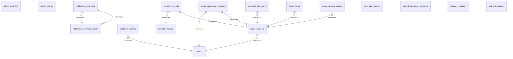

# Diagrama entidade-relacionamento — site_private (Etapa 48)

Gerado por `npm run db:site:schema-doc` a partir de `pg_constraint` no banco local, na versão do schema da migration mais recente (2026-09-17). Complementa `docs/DATABASE_DICTIONARY.md` (colunas e comentários) com as relações entre tabelas.

## Verificação de drift

CI (`database.yml`) roda `supabase db diff --local` implicitamente via `db reset` a partir das migrations — se o schema real não corresponder ao que as migrations descrevem, `db reset` falha antes mesmo de chegar neste script. Este arquivo, por sua vez, falha o build se estiver desatualizado em relação ao que `db reset` produziu (mesmo padrão de `src/types/site-database.types.ts` e `docs/DATABASE_DICTIONARY.md`).
